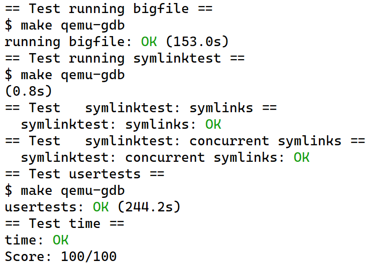

# FOREWORD

[](https://github.com/endless-hu/xv6-labs-2021-public/actions/workflows/lab_util.yml)
[](https://github.com/endless-hu/xv6-labs-2021-public/actions/workflows/lab_syscall.yml)
[](https://github.com/endless-hu/xv6-labs-2021-public/actions/workflows/lab_pgtbl.yml)
[](https://github.com/endless-hu/xv6-labs-2021-public/actions/workflows/lab_traps.yml)
[](https://github.com/endless-hu/xv6-labs-2021-public/actions/workflows/lab_cow.yml)
[](https://github.com/endless-hu/xv6-labs-2021-public/actions/workflows/lab_thread.yml)
[](https://github.com/endless-hu/xv6-labs-2021-public/actions/workflows/lab_net.yml)
[](https://github.com/endless-hu/xv6-labs-2021-public/actions/workflows/lab_lock.yml)
[](https://github.com/endless-hu/xv6-labs-2021-public/actions/workflows/lab_fs.yml)
[](https://github.com/endless-hu/xv6-labs-2021-public/actions/workflows/lab_mmap.yml)

This is my project report for [MIT 6.S081(Operating System), 2021 Fall](https://pdos.csail.mit.edu/6.S081/2021/schedule.html). 

**PLEASE NOTE: The hyperlinks to my source code in this repo are INVALID!!! This is a __public__ version of my project. I don't open my source code because it is a course project and I believe I'm obliged to help protect academic integrity.**

# Automatic Testing (`Ubuntu/Debian` ONLY)

### 1. Setup Build Environment

Run the script to set up your building environment:

```
$ sudo ./setup.sh
```

### 2. Run Tests

If you just run:

```
$ bash test.sh
```

Or

```
$ chmod 755 test.sh
$ ./test.sh
```

Then **ALL** labs' tests will be executed, which estimated for **TWENTY MINUTES!!!**


You can also specify which test(s) you want to execute, just append the lab's name:

```
$ ./test.sh util syscall pgtbl
```

# Build Instructions

**BEFORE BUILDING AND TESTING MY CODE, MAKE SURE THAT YOU HAVE SET UP BUILDING ENVIRONMENT!!!**

### For `Debian` Or `Ubuntu`

```
$ sudo apt-get update && sudo apt-get upgrade
$ sudo apt-get install git build-essential gdb-multiarch qemu-system-misc gcc-riscv64-linux-gnu binutils-riscv64-linux-gnu
```

### Installing on `macOS`

First, install developer tools:

```
$ xcode-select --install
```

Next, install [Homebrew](https://brew.sh/), a package manager for macOS:

```
$ /usr/bin/ruby -e "$(curl -fsSL https://raw.githubusercontent.com/Homebrew/install/master/install)"
```

Next, install the [RISC-V compiler toolchain](https://github.com/riscv/homebrew-riscv):

```
$ brew tap riscv/riscv
$ brew install riscv-tools
```

The brew formula may not link into `/usr/local`. You will need to update your shell's rc file (e.g. [~/.bashrc](https://www.gnu.org/software/bash/manual/html_node/Bash-Startup-Files.html)) to add the appropriate directory to [$PATH](http://www.linfo.org/path_env_var.html).

```
PATH=$PATH:/usr/local/opt/riscv-gnu-toolchain/bin
```

Finally, install `QEMU`:

```
brew install qemu
```

### For Other Systems

**Please refer to [instructions on the course website](https://pdos.csail.mit.edu/6.S081/2021/tools.html).**

# Test Instructions

<del>The test can ONLY be done one by one. </del>

To inspect my code, **first switch to the branch you wish.** For example, if you want to see my implementation of `Lab Util`, first type:

```
$ git checkout util
```

Then you are free to browse my code for `Lab Util`.

To test it, run:

```
$ make grade
```

It will automatically run all test cases and finally give out my scores.

# Project Overview

## Lab 1 - Unix Utilities

The original requirements can be found [here](https://pdos.csail.mit.edu/6.S081/2021/labs/util.html).

### Tasks

To implement following functions:

- `sleep`: Pause for a user-specified number of ticks
- `pingpong`: Use UNIX system calls to "ping-pong" a byte between two processes over a pair of pipes, one for each direction. 
- `primes`: Write a concurrent version of prime sieve using pipes.
- `find`: Write a simple version of the UNIX find program: find all the files in a directory tree with a specific name.
- `xargs`: Write a simple version of the UNIX xargs program: read lines from the standard input and run a command for each line, supplying the line as arguments to the command.

### Relevant Files

**REMINDER: PLEASE SWITCH TO THE CORRECT BRANCH BY: `$ git checkout util`**

```
user/sleep.c
user/pingpong.c
user/primes.c
user/find.c
user/xargs.c
```

## Lab 2 - System Calls

The original requirements can be found [here](https://pdos.csail.mit.edu/6.S081/2021/labs/syscall.html).

### Tasks

To implement the following two functions in the kernel:

- `trace`: Add a system call tracing feature. It should take one argument, an integer "mask", whose bits specify which system calls to trace. Modify the xv6 kernel to print out a line when each system call is about to return, if the system call's number is set in the mask.
- `sysinfo`: It collects information about the running system. The system call takes one argument: a pointer to a `struct sysinfo` (see `kernel/sysinfo.h`). The kernel should fill out the fields of this struct: the `freemem` field should be set to the number of bytes of free memory, and the `nproc` field should be set to the number of processes whose `state` is not `UNUSED`.

### Relevant Files

**REMINDER: PLEASE SWITCH TO THE CORRECT BRANCH BY: `$ git checkout syscall`**

```
kernel/proc.c
kernel/syscall.c
kernel/kalloc.c
```

## Lab 3 - Page Table

The original requirements can be found [here](https://pdos.csail.mit.edu/6.S081/2021/labs/pgtbl.html).

### Tasks

To implement the following three functions in the kernel:

- **Make it possible for processes in user mode to directly retrieve `pid` without entering kernel.** When each process is created, map one read-only page at `USYSCALL` (a VA defined in `memlayout.h`). At the start of this page, store a `struct usyscall` (also defined in `memlayout.h`), and initialize it to store the `PID` of the current process. 
- `vmprint()`: It should take a `pagetable_t` argument, and print that `pagetable`.
- `sys_pgaccess()`: return the info of accessed pages to the buffer passed in by user.

### Relevant Files

**REMINDER: PLEASE SWITCH TO THE CORRECT BRANCH BY:**

```
$ git checkout pgtbl
```

**See the report in the branch `pgtbl`**

## Lab 4 - Traps

The original requirements can be found [here](https://pdos.csail.mit.edu/6.S081/2021/labs/traps.html).

### Tasks

- Implement the `backtrace` function to print out the return addresses of the functions which are called.
- Implement `sigalarm(int ticks, (void *handler)())` so that it will set an alarm which will set off at the interval of `ticks`. When the alarm set off, the system will call the `handler` function to handle the alarm. Call `sigalarm(0, 0)` to unset the alarm.

### Relevant Files

**REMINDER: PLEASE SWITCH TO THE CORRECT BRANCH BY:**

```
$ git checkout traps
```

**See the report in the branch `traps`**

## Lab 5 - Copy-On-Write

The original requirements can be found [here](https://pdos.csail.mit.edu/6.S081/2021/labs/cow.html).

### Tasks

To implement copy-on-write fork in the xv6 kernel.

#### Specification

The goal of copy-on-write (COW) `fork()` is to defer allocating and copying physical memory pages for the child until the copies are actually needed, if ever.

COW `fork()` creates just a `pagetable` for the child, with `PTE`s for user memory pointing to the parent's physical pages. COW fork() marks all the user `PTE`s in both parent and child as not writable. When either process tries to write one of these COW pages, the CPU will force a page fault. The kernel page-fault handler detects this case, allocates a page of physical memory for the faulting process, copies the original page into the new page, and modifies the relevant `PTE` in the faulting process to refer to the new page, this time with the `PTE` marked writeable. When the page fault handler returns, the user process will be able to write its copy of the page.

COW `fork()` makes freeing of the physical pages that implement user memory a little trickier. A given physical page may be referred to by multiple processes' page tables, and should be freed only when the last reference disappears.

### Detailed Reports

**REMINDER: PLEASE SWITCH TO THE CORRECT BRANCH BY:**

```
$ git checkout cow
```

**See the report in the branch `cow`**

## Lab 6 - Multi-Threading

The original requirements can be found [here](https://pdos.csail.mit.edu/6.S081/2021/labs/thread.html).

### Tasks

- `Uthread`: Design the context switch mechanism for a user-level threading system, and then implement it.
- `Using threads`: Explore parallel programming with threads and locks using a hash table.
- Implement a [barrier](http://en.wikipedia.org/wiki/Barrier_(computer_science)): a point in an application at which all participating threads must wait until all other participating threads reach that point too. Use `pthread` condition variables, which are a sequence coordination technique similar to `xv6`'s sleep and wakeup.

### Detailed Reports

**REMINDER: PLEASE SWITCH TO THE CORRECT BRANCH BY:**

```
$ git checkout thread
```

**See the report in the branch `thread`**

## Lab 7 - Networking

The original requirements can be found [here](https://pdos.csail.mit.edu/6.S081/2021/labs/net.html).

### Task

Your job is to complete `e1000_transmit()` and `e1000_recv()`, both in `kernel/e1000.c`, so that the driver can transmit and receive packets. You are done when `make grade` says your solution passes all the tests.

### Pit Falls

- Every time `e1000_recv()` is called, there could be multiple packages waiting to be read. 
  If not all of these packages are processed, then the program will just sleep forever, while the switcher cannot find any `RUNNABLE` thread to execute.
- `net_rx()`, which is called in `e1000_recv()`, will finally call `e1000_transmit()`. Since we need to add lock for both `e1000_transmit()` and `e1000_recv()`, it's impossible to just add a lock through out the functions. 

### Code

**PLEASE SWITCH TO THE CORRECT BRANCH BY:**

```
$ git checkout net
```

**No detailed report provided because the hints in the lab specification are lucid enough.**

## Lab 8 - Lock

The original requirements can be found [here](https://pdos.csail.mit.edu/6.S081/2021/labs/lock.html).

### Tasks

- To implement per-CPU freelists, and stealing when a CPU's free list is empty, so that lock contentions can be reduced.
- Modify the block cache so that the number of `acquire` loop iterations for all locks in the bcache is close to zero when running `bcachetest`. Use hash table to minimize lock contention on `bcache.lock`.

### Detailed Report

**PLEASE SWITCH TO THE CORRECT BRANCH BY:**

```
$ git checkout lock
```

**See the report in the branch `lock`**

## Lab 9 - File System

Here is [the original requirement](https://pdos.csail.mit.edu/6.S081/2021/labs/fs.html).

### Tasks

- Increase the maximum size of an xv6 file from $12+256=268 \ blocks$ to $(11+256+256^2) blocks$
- Implement the `symlink(char *target, char *path)` system call, which creates a new symbolic link at path that refers to file named by `target`.

### Detailed Report

**PLEASE SWITCH TO THE CORRECT BRANCH BY:**

```
$ git checkout fs
```

**See the report in the branch `fs`**

## Lab 10 - mmap

Here is [the original requirement](https://pdos.csail.mit.edu/6.S081/2021/labs/mmap.html).

### Tasks

Implement enough `mmap` and `munmap` functionality, including:

- `mmap` a file to a virtual area which is allocated by the OS applying the lazy allocation. Support setting `PROT`(`PROT_READ, PROT_WRITE, PROT_EXEC`), `flags`(`MAP_SHARED, MAP_PRIVATE`), offset and length. When the mmap-ed page is accessed, it will invoke a page fault and the OS will read in the corresponding page in the related file to that mmap-ed page.
- `munmap` the mmap-ed pages. It cannot unmap a hole in the virtual area.
- After adding these features, the normal system operations like `fork()` and other illegal page faults are still processed correctly. 

### Detailed Report

**PLEASE SWITCH TO THE CORRECT BRANCH BY:**

```
$ git checkout mmap
```

**See the report in the branch `mmap`**

# Test Results

## Lab 1


## Lab 2


## Lab 3


**Note**: *The `usertests` is time-consuming. If your computer has a weak performance, the `usertests` may fail because of time out.*

## Lab 4


## Lab 5


## Lab 6


## Lab 7


## Lab 8

**NOTE: THERE ARE SOME BUGS IN THE ORIGINAL CODE. I FIXED IT.**

**IF YOU HAVE QUESTIONS, SEE THE DETAILED REPORT.**


## Lab 9

**Note**: *The `usertests` is __EVEN MORE TIME-CONSUMING__. If your computer has a weak performance, the `usertests` may fail because of time out.*



## Lab 10


