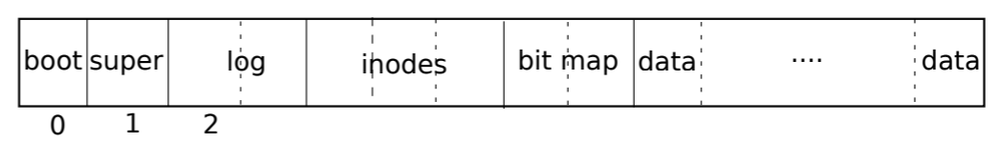

# OS Summery

Operating systems serve as schedulers of hardware resources, including CPUs, volatile memories (RAM), non-volatile memories (ROM, flash and disks), to support softwares running on top of them. They create a usable environment so that softwares do not need to directly negotiate with hardwares to perform their operations. 

Again the existence of OS proves the importance of abstraction in computer science. By layered abstractions, programmers' lives are greatly eased.  

This course explored the features and functions of a tiny, Unix-like operating system named `xv6`. It mainly focus on the following topics: *user/kernel isolation*, *memory management*, *process management*, *file systems*, and *networks*.

## `RISC-V` Architecture

Before we discuss how OS works, we should first know basic hardwares under the OS. Here I provide a brief introduction to the `RISC-V` registers and their functions.

### Registers

| Name     | Brief Description                                  | Notes                                                        |
| -------- | -------------------------------------------------- | ------------------------------------------------------------ |
| `scause` | The cause of a trap.                               | `2` represents system call;<br />`0xd` represents page fault. |
| `stvec`  | The **physical** address where the trap should go. | In user space, it's set to `kernel/trampoline.S::uservec`    |
| `stval`  | The address which causes the trap.                 | If the trap is from user, it is *virtual address*;<br />else it is *kernel address* |
| `epc`    | Points to the instruction that causes the trap     | Also the place where the trap will return.                   |
| `ra`     | The address where the function will return.        | Return Address                                               |
| `satp`   | The pointer to the current process's page table.   | When in kernel mode, it points to kernel page table.         |
| `fp`     | Points to the current function frame.              | Frame Pointer                                                |

-------------------------


## PART 1. User/Kernel Isolation

### Benefits

The idea of user/kernel isolation is to provide softwares with APIs to perform system level tasks (mainly I/O). It has many advantages, including:

1. **Make user program cleaner.** Without these APIs, the user program has to directly negotiate with hardwares, most of which are repetitive work. 
2. **Secure the hardware.** User programs are likely to have bugs. If we allow user programs to directly access hardwares, they will probably ruin hardwares. For example, if they can directly access disks, the potential bugs in them may destroy the structure of the disk and make it unusable. 
3. **Protect the system.** Kernel has its own data structures, and they should not be accessed by user programs. Clearly isolate them will keep the system running normally.

### Implementation - System Calls

In user space, when a system call function is invoked, like this:

```c
pid = fork();
```

The assembly code behind the scene is: 

```assembly
    pid = fork();
  50:	00000097          	auipc	ra,0x0
  54:	33c080e7          	jalr	828(ra) # 38c <fork>
  
  ......
  
  000000000000038c <fork>:
.global fork
fork:
 li a7, SYS_fork
 38c:	4885                	li	a7,1    # Load `a7` with the system call number
 ecall
 38e:	00000073          	ecall         # Here enters kernel mode
 ret
 392:	8082                	ret
```

The system use the `RISC-V` instruction `ecall` to switch to kernel mode from user mode. 

#### What Does `ecall` Do?

1. Save the `pc` to `epc`, record the trap cause (`2`) in the `sscause`;
2. Jump to the address in `stvec`, which is its trampoline page;

To know the detail of trampoline page, please visit the [Trampoline](#Trampoline) section.

--------------------


## PART 2. Memory Management - Virtual Memory

### Why

1. **Isolate** the memory spaces between different user programs;
2. Provide a **continuous** memory space to user programs;
3. More **flexibility** to manage memories, such as **lazy allocation**.

### Memory Space and Mapping


### Implementation - Page Table

The virtual memory translation process, done by MMU (Memory Management Unit):


The structure of *PTE (Page Table Entry)* is:


To avoid the cost of loading PTEs from physical memory, a `RISC-V` CPU caches page table entries in a *Translation Look-aside Buffer (TLB)*.

#### Special Pages

##### Trampoline

The page contains the code to switch between kernel page table and user page table.

The trampoline page switches user mode to kernel mode by:

1. Swap the register `a0` with `sscratch`(the register containing the address of `trapframe`)
2. Use `a0` as the base address, save user registers in the process's `trapframe` page;
3. Save the user's `a0`(now it's in `sscratch`) to the `trapframe` by utilizing a temporary register `t0`;
4. Also from the process's `trapframe` page, set up the kernel's program space, including its stack pointer, `satp`, etc;
3. Jump to `usertrap()`, whose address is also stored in the `trapframe`.

**Note:** Because the trampoline page is mapped the same address both in user page table and kernel page table, **switch `satp` is FINE within the trampoline page.**

##### Trap Frame

The page saves all the information needed to switch between user space and kernel space, including the user registers, kernel registers, address of `usertrap()` and `usertrapret()`, etc. And from the user program's standpoint, it is as if not interrupted. 

### Fancy Application - Lazy Allocation

#### Main Idea

When program apply for more spaces, only map these spaces in the program's page table, but do not allocate physically memory to them. 

To avoid problems of reading and writing these spaces, the kernel will set the access flags in these PTEs to prevent some operations. 

When these operations occur, the kernel will handle the page fault and allocate physically spaces for the lazily allocated address, and give these addresses full accesses. 

#### Benefits

1. **Speed up some system calls**, such as `fork()`. Because we no longer allocate physical memories for `fork()`, even if we want to `fork` a large process, it can be done right away, no need to wait for memory copy.
2. **Save physical spaces.** Programs tend to *claim more space than they need* to cope with the worst situation. However, they usually work under a much better situation, which does not require so much spaces. Lazy allocation only allocates memory that is used by the program, which helps save physical memory in most cases.
3. **Make it possible to load a file bigger than the physical memory.** In the lab `mmap`, we can designate a range of virtual addresses that *map* the file. 
   Since we do not allocate physical spaces for these addresses, they can be arbitrarily long, as long as they do not exceed the numeric limit of 64-bit addresses. 
   Only when the program wants to read some pages in that virtual memory area will the kernel read the corresponding pages of the mmap-ed file into these virtual memories.

-----------------------


## PART 3. Process Management

### Aims

1. Given only **ONE** CPU, how to run multiple processes on it and make they seem to run concurrently;
2. Given **multiple** CPUs and a **shared** memory, how to coordinate the CPUs to achieve parallel execution of **one** process and still maintain correctness.

### Implementations

#### Thread Switch And Scheduler

It is the core mechanism of multi-threading on a single CPU.

##### A Big Picture

1. The system maintains a process table, `struct proc[NPROC]`, which represents the processes running on that CPU.
2. Every CPU is initialized with a scheduler process when the system boots up. 
3. There are **4** kinds of states for a process: UNUSED, RUNNING, RUNNABLE, SLEEP.
4. The scheduler process will loop through the whole process array forever, trying to find a process whose state is **RUNNABLE**.
5. Once it finds one, it will set the process's state to RUNNING, switch to that process and continue the execution of that process. 
6. When the process is interrupted by time interruption and should yield the CPU, it will set its state to RUNNABLE again and jump back to the scheduler process. 

##### A Concrete Example

Let's look at the code in `kernel/proc.c` and `kernel/trap.c` to gain a more concrete sense about how thread switch works.

1. When the system boots up, the first CPU (`cpuid == 0`) will call `userinit()` after it initialized the process table (`struct proc[NPROC]`), to create the first user process, the shell. At this point, the shell is the only **RUNNABLE** process.
2. After everything is set up, the CPU will call `scheduler()` to find a RUNNABLE process to execute. 
3. Now the shell is picked because it is the only RUNNABLE process. 
4. The scheduler will call `swtch()` to switch the *context* (*__Context__ is merely the `ra, sp` and other callee-saved registers*) of the CPU and the process. Because `ra`, the Return Address is changed to the process's `ra`, the CPU will *return* to the process under the process's context and start executing the process.
5. When the shell is executing, it may encounter a time interrupt, in which it should **yield** the CPU it occupies to other processes waiting for that CPU. 
6. **Yield** will call `sched()`, which calls `swtch` to switch back to the point where the scheduler switched its context with the process.

#### Concurrent Control - Locks

Locks serve as a barrier so that before going on some operations, the CPU should grab it. 

This feature helps to prevent multiple CPUs from interleaving their operations on a shared data structure which requires these operations should be done atomically. 

In short, the lock ensures that its following operations are only be executed by ONE CPU serially.

##### Original Idea

The structure of a `spinlock` is:

```c
struct spinlock {
  uint locked;       // Is the lock held?
  // For debugging:
  char *name;        // Name of lock.
  struct cpu *cpu;   // The cpu holding the lock.
};
```

Originally, if we want to acquire a lock, we only need to perform the following steps:

```c
void acquire(struct spinlock *lk) {
  while (lk->locked) ;  // wait until the lock was released
  lk->locked = 1;
  lk->cpu = mycpu();
}
```

However, the above code cannot guarantee the atomicity of these operations. If two CPUs race at line 2, they both think that they grabbed the lock and that definitely is not what we want to see. 

##### A Way Out

If the code at line 2 and 3 can be done atomically, then the problem is solved.

Most ISAs provide instructions to support `atomic swap and test` instruction.

```c
  // On RISC-V, sync_lock_test_and_set turns into an atomic swap:
  //   a5 = 1
  //   s1 = &lk->locked
  //   amoswap.w.aq a5, a5, (s1)
  while(__sync_lock_test_and_set(&lk->locked, 1) != 0)
    ;
  // Here the lock is grabbed
```

---


## PART 4. File System

### Aims

1. Structure the disk space to make it easier to find a file;
2. Files and directories should be structured in a hierarchal way so that it would make people's life easier to find a file by its path;
3. Accelerate the access speed by using cache;
4. Ensure the data's integrity on disks even if there's a sudden crash, such as power failure.

### Layers


##### Top-Down Illustration

1. **File Descriptor.** The file is represented as a `struct` as follows:

   ```c
   struct file {
     enum { FD_NONE, FD_PIPE, FD_INODE, FD_DEVICE } type;
     int ref; // reference count
     char readable;
     char writable;
     struct pipe *pipe; // FD_PIPE
     struct inode *ip;  // FD_INODE and FD_DEVICE
     uint off;          // FD_INODE
     short major;       // FD_DEVICE
   };
   ```

   The operating system maintains an array of `struct file` as the `ftable`:

   ```c
   struct {
     struct spinlock lock;
     struct file file[NFILE];
   } ftable;
   ```

   The essence of a *file descriptor* is the *offset* in the array.

   **Because devices, pipes are all considered as "file" in operating system, in the following discussion we ONLY focus on the "disk files", which link to `inode`s.**

2. **Pathname** solves the problem of addressing a file in a human-readable way. We hope to *open* a file by its pathname. 

   To look up a file, for example, `/etc/passwd`, the system will start from a root directory `/`, and look through its contents, `struct dirent` (Directory Entry), to find the entry whose name matches "etc". 

   Then it gets the `inode` pointer of the directory "etc" and find the file "passwd" in it.

   Finally it returns the `inode` pointer of the file "passwd".

3. **Directory** is a special kind of `inode`. Normally we store customized data in files, but *directory* contains *Directory Entries*, a special data structure indicating the entries of the directory:

   ```c
   struct dirent {
     ushort inum;        // The inode number on disk
     char name[DIRSIZ];  // The entry's name
   };
   ```

4. **Inode** is where the files and directories are represented and stored. Its structure is:

   ```c
   struct dinode {
     short type;           // File type
     short major;          // Major device number (T_DEVICE only)
     short minor;          // Minor device number (T_DEVICE only)
     short nlink;          // Number of links to inode in file system
     uint size;            // Size of file (bytes)
     uint addrs[NDIRECT+2];   // Data block addresses
   };
   ```

   It can also be delineated by the following graph:

   

   **Note:** The *size* of each block is 1024 **bytes**, and the length of an *address* is 32 **bits**. *Here the __address__ means the block's __offset__ on disk.*

   Therefore, an indirect block can contain at most `1024*8/32 = 256` addresses.

5. **Logging** ensures that the data structure on the disk will not be corrupted when it performs writing to the disk while there's a power failure. 

   It achieves the goal by writing to the *log* area first, then copy the *log* block to the corresponding data block, finally clear the log area, indicating the success of the writing.

6. **Buffer cache** speeds up the block retrieving from the disk. Because the disk I/O is expensive, CPU will *cache* the blocks read from the disk so that next time it can be got directly from the memory.

   ```c
   struct buf {
     int valid;   // has data been read from disk?
     int disk;    // does disk "own" buf?
     uint dev;    // which device does the buf belong to?
     uint blockno;  // the block number of the buf
     struct sleeplock lock;
     uint refcnt;
     struct buf *prev; // LRU cache list
     struct buf *next;
     uchar data[BSIZE];
   };
   
   struct {
     struct spinlock lock;
     struct buf buf[NBUF];
   
     // Linked list of all buffers, through prev/next.
     // Sorted by how recently the buffer was used.
     // head.next is most recent, head.prev is least.
     struct buf head;
   } bcache;
   ```

7. **Disk** is the hardware level where data resides.

   

   There's a `type` field in `struct inode` to distinguish directory and file. **Directory `inode`s** are also *files*, but it contains the *name and inode index* of its files or subdirectories. 

   **Bit map** is a block. It indicates the availability of its following 8192 data blocks because each block contains 1024 bytes, and each bit in the bit map block indicates one data block.

### Implementations

#### I/O

From the perspective of a user program, the I/O operation is finished by calling `read(fd, dst, len)` or `write(fd, src, len)`. However, the `fd` can represent a file, a pipe, or a UART device. Their implementations are quite different.

I will cite the `read()` system call as the example in the following discussion.

When `read()` is called, it will be passed to `sys_read()` by the `sys_call()` function. in `sys_read()`, the parameters such as `fd, dst, len` are got, then `fileread()` is called.

Depending on the file's type, `file_read()` will call different functions to process the `struct file`.

##### Inode

`file_read()` will call `readi()`, in which the content of the file is read into the destination address.

As we can see in the structure of an `inode`, the data of the `inode` is organized in an array of block index. `readi()` will sequentially scan the array, read every data block to the address. 

Because disk I/O is time-consuming, the system will cache the blocks it reads into a buffer cache.

##### Pipe

Pipe can be used to communicate between processes. You can write to one end and read what you wrote on the other end.

```c
struct pipe {
  struct spinlock lock;
  char data[PIPESIZE];
  uint nread;     // number of bytes read
  uint nwrite;    // number of bytes written
  int readopen;   // read fd is still open
  int writeopen;  // write fd is still open
};
```

When allocating a pipe, *two* `struct file`s point to a *same* `struct pipe`. One `struct file` is intended for `read()`, so it's ONLY *readable*; the other file is intended for `write()`, so it's ONLY *writable*. 

The `struct pipe` is just like the data structure `queue`, where `nwrite => back, nread => front`. When you write something, you *append* the data to the end of the `queue`; when you read, you *pop* data from the front of the `queue`.

`nwrite` and `nread` travel the limited array circularly, so that the pipe can transfer unlimited data as long as the data written is read timely. 

**Reminder**: Recall what you learned from *FDS*, when `(back + 1) % size == front`, then the `queue` is full and you cannot append anything to its back even it still has one room remaining. If we allow `back == front` when the `queue` is full, then it will be impossible to distinguish the status of `empty` and `full` for the `queue`. 

##### UART/Console

Please see the code `kernel/uart.c` if you are interested. I did not spend a lot of time reading that part.

Generally they are peripherals working in parallel with CPU. When CPU want to write something to the console, it will just tell the console what to output, and the console faithfully finished its task.

**Note:** Usually, **file descriptor 0** is assigned to the *standard input* (`stdin`). **File descriptor 1** is assigned to the *standard output* (`stdout`). And **file descriptor 2** is assigned to *standard error* (`stderr`).

#### Application: I/O Redirection

##### Cases

In Linux, it is common to use the command like:

```bash
$ ls /usr/bin | grep "cmake"
$ cat id_rsa.pub >> authorized_keys
```

The operators such as `|`, `>`, `>>`, etc are *redirection* operators:

1. `|` *pipelines* the left program's output to the right program's input.
2.  `>` *redirects* the left program's output to the right file.
3. `>>` *appends* the left program's output to the right file.

##### Analysis

They achieve these results in a same manner. Let's use the first example to illustrate it.

1. The left program, 

   ```bash
   $ ls /usr/bin 
   ```

   will print all executable programs in `/usr/bin` directory to the standard output (the console).

   While the right program, 

   ```bash
   $ grep "cmake"
   ```

   will read content from `stdin` and try to match the pattern "cmake" in the input string.

2. When the shell encounters the pipeline operator `|`, it will *close* the **file descriptor 0 and 1**, which represent `stdin` and `stdout`, respectively. 

3. Then a pipe is created. **File descriptor 0** is assigned to the pipe's *read* end, and **file descriptor 1** is assigned to the pipe's *write* end.

4. When `ls` prints its output, it *thinks* that it prints the result to the console. However, because of the trick played in the system's kernel, now `ls` *actually* prints its output to a pipe;

5. Same for the `grep`. It *thinks* that it reads the content from the console, but *actually* it reads the content from a pipe.

#### File Link

The `link` just establishes the relation between a file name and an inode. 

For example, if we want to create a file `/home/.ssh/id_rsa`:

1. Allocate an inode from the disk (at the same time *get the inode index*), write content to the inode;
2. Under the inode of the directory `/home/.ssh`, we append a `struct dirent` to it, record the name as `id_rsa`, and the inode index from the *step 1*.


#### Logging Scheme

This topic is crucial in the field of database system. 

The scheme described here is called *Write-Ahead Log* in database system's jargon.

##### Structure of Log

```c
struct logheader {
  int n;               // How many blocks in the log header
  int block[LOGSIZE];  // the destination of each logged block
};

struct log {
  struct spinlock lock;
  int start;           // the start position of the log in "log area"
  int size;            // the size of the log
  int outstanding; // how many FS sys calls are executing.
  int committing;  // in commit(), please wait.
  int dev;
  struct logheader lh;
};
struct log log;
```

##### Log Process

When you want to write something to an inode, logging will:

1. Write modified blocks from cache to *log area* on the disk;
2. Write the log head block on the disk;
3. Copy the *log* block to the corresponding data block.
4. Clear the log area, indicating the success of the writing.

##### Security Analysis

No matter in which process a power failure comes, the file system is always in a good shape.

1. If it occurs at *step 1*: 

   The inode and the data areas are unaffected, OK;

2. The device ensure that a writing to a single block is atomic, so a power failure cannot interrupt the *step 2* and leave an inconsistent log head block;

3. If power failure occurs at *step 3*: 

   The data area is inconsistent now. But that's fine. 

   When the system boots up again, it will check the disk's log area, and find that there's an undone log (because `loghead.n != 0`). So it will install the log to its target and clear it by erase the head.

