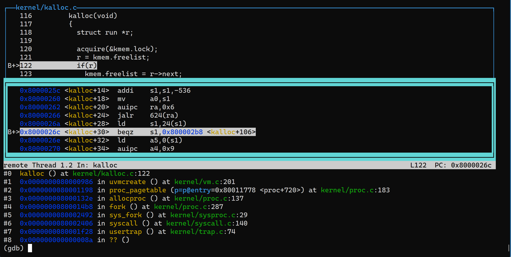

# Lab 5 - Copy-On-Write

[Here](https://pdos.csail.mit.edu/6.S081/2021/labs/cow.html) is the original lab specifics.

## Task

The goal of copy-on-write (COW) fork() is to defer allocating and copying physical memory pages for the child until the copies are actually needed, if ever.

COW fork() creates just a `pagetable` for the child, with `PTE`s for user memory pointing to the parent's physical pages. COW fork() marks all the user `PTE`s in both parent and child as not writable. When either process tries to write one of these COW pages, the CPU will force a page fault. The kernel page-fault handler detects this case, allocates a page of physical memory for the faulting process, copies the original page into the new page, and modifies the relevant `PTE` in the faulting process to refer to the new page, this time with the `PTE` marked writeable. When the page fault handler returns, the user process will be able to write its copy of the page.

COW fork() makes freeing of the physical pages that implement user memory a little trickier. A given physical page may be referred to by multiple processes' page tables, and should be freed only when the last reference disappears.

## Some hints

Here's a reasonable plan of attack.

1. Modify `uvmcopy()` to map the parent's physical pages into the child, instead of allocating new pages. Clear `PTE_W` in the ``PTE``s of both child and parent.
2. Modify `usertrap()` to recognize page faults. When a page-fault occurs on a COW page, allocate a new page with `kalloc()`, copy the old page to the new page, and install the new page in the `PTE` with `PTE_W` set.
3. Ensure that each physical page is freed when the last `PTE` reference to it goes away -- but not before. A good way to do this is to keep, for each physical page, a "reference count" of the number of user page tables that refer to that page. Set a page's reference count to one when `kalloc()` allocates it. Increment a page's reference count when fork causes a child to share the page, and decrement a page's count each time any process drops the page from its page table. `kfree()` should only place a page back on the free list if its reference count is zero. It's OK to to keep these counts in a fixed-size array of integers. You'll have to work out a scheme for how to index the array and how to choose its size. For example, you could index the array with the page's physical address divided by 4096, and give the array a number of elements equal to highest physical address of any page placed on the free list by `kinit()` in `kalloc.c`.
4. Modify `copyout()` to use the same scheme as page faults when it encounters a COW page.

Some hints:

- The lazy page allocation lab has likely made you familiar with much of the xv6 kernel code that's relevant for copy-on-write. However, you should not base this lab on your lazy allocation solution; instead, please start with a fresh copy of xv6 as directed above.
- It may be useful to have a way to record, for each `PTE`, whether it is a COW mapping. You can use the `RSW` (reserved for software) bits in the RISC-V `PTE` for this.
- `usertests` explores scenarios that `cowtest` does not test, so don't forget to check that all tests pass for both.
- Some helpful macros and definitions for page table flags are at the end of `kernel/riscv.h`.
- If a COW page fault occurs and there's no free memory, the process should be killed.

## Solution

1. Construct a reference count `struct` to record the reference count of each page by:

   ```c
   struct RefCount
   {
     struct spinlock lock;
     uint8 ref_count[(PHYSTOP - KERNBASE) / PGSIZE];
   } ref_count;
   ```

2. In [`kernel/kalloc.c:kinit()`](kernel/kalloc.c), initialize `ref_count.lock` and set all `ref_count` to 0 in `kinit()`;
   In `kalloc()`, after allocating a new page, increase its `ref_count`;
   In `kfree()`, first decrease the page's `ref_count`, then free the page if its `ref_count == 0`.

3. In  [`kernel/vm.c:uvmcopy()`](kernel/vm.c) , map the parent's physical pages into the child, instead of allocating new pages. Clear `PTE_W` and set `PTE_RSW1` in the `PTE`s of both child and parent.

4. In [`kernel/trap.c:usertrap()`](kernel/trap.c), before processing the trap, first acquire `ref_count.lock`(**THE READING AND WRITING OF `ref_count` MUST BE PROTECTED BY ITS LOCK!!!**), then:
   **4.1.** If it is a system call (`r_scause() == 8`), then release `ref_count.lock` immediately, do not modify anything;
   **4.2.** If it is a page fault (`r_scause() == 15`), and its reference count is **greater than** 1 (which means one of its referrer want to write something to it), allocate a new duplication of it, unset the new page's `COW` bit and set the `PTE_W` bit. **REMEMBER TO CHECK WHETHER THE `va` OF THE FAULTING PAGE IS POSSIBLE!!!**
   **4.3.** If it is a page fault (`r_scause() == 15`), and its reference count **is** 1 (which means its ONLY referrer want to write something to it), make the page write-able and unset the `COW` bit.
   **4.4.** Otherwise it is an abnormal situation, give the warning output.
   **4.5. AFTER EVERY PROCESSING, REMEMBER TO RELEASE `ref_count.lock`!!!**

5. In [`kernel/vm.c:copyout()`](kernel/vm.c), use the same mechanism above.

### Pitfalls

- Decrease the page reference count in `kfree()` instead of other places such as `uvmunmap()`. 
  *Because in `kalloc()` the `ref_count` is increased by 1 unconditionally, there will not be any problem to decrease it in `kfree()`.*
- The increase, decrease and read the `ref_count` of a page need a spin lock held. Otherwise there will be concurrency problems. 
  <del>*The bug in this lab has something to do with it. See the following section discussing about the bug.*</del>
- <del>There should be some mechanism to free pages when memory is out in `exec()`. But it seems that `exec()` provides that mechanism. </del>
  <del>*I do not know how my implementation of COW disturbs the `exec()`.*</del>
  They are caused by the bug in `usertrap()` when it is handling page fault but there's no free pages, see [the next section](#Solution-2).

### Remaining Bugs [None]

**Update on 01/12/2021: ALL BUGS ARE FIXED**

-------------------------------------------------------------------------------------------------------------------

There are sometimes weird bugs when I'm running `usertests`. I believe they are caused by **CONCURRENCY CONTROL** because these bugs occur randomly, which fits the characters of concurrent situation. 

#### [FIXED] Free Page In CONCURRENCY Situation

##### Description

If I make the `xv6` running in single core mode:

```
$ make CPUS=1 qemu
```

Then the `usertests` will succeed<del>(except `execout()` test)</del> without loss of any pages. 

However, if the `xv6` is running in **double cores**, the `usertests` will **fail** because when it executes all tests, the system lost some free pages. In another word, the system did not free all the allocated pages. 

*I tested `forktest` and `echo` in __double core__ situation, both of which __DID NOT suffer loss of free pages__.*

##### Assumption

I suppose that it is because under concurrent situation, `kfree()` may read a non-zero reference count when the real reference count is 0. Therefore, it did not perform `free` when it should do.

##### Solution

<del>A elegant locking scheme is necessary, but I have not come up with one.</del>

<del>I tried some schemes, but they may cause problems in the normal cases.</del>

Always acquire `ref_count.lock` before reading and writing to `ref_count` and release the lock until a block of operations are done.

#### [FIXED] Panic When Memory Is Out

**THE BUG IS FIXED, SEE [THE _SOLUTION_ PART](#solution-2)!**

##### Description

`execout()` will cause a kernel panic, which makes it difficult for me to debug.

The log is like this:

```
test execout: kernel_trap(): scause 0x000000000000000f
sepc=0x000000008000026c stval=0x0000000000000000
kernel_trap(): scause 0x000000000000000d
sepc=0x00000000800020f0 stval=0x001000007ff89060
kernel_trap(): scause 0x000000000000000d
sepc=0x00000000800020f0 stval=0x0000010080008fe9
kernel_trap(): scause 0x000000000000000d
sepc=0x00000000800020f0 stval=0x0000000090009068
ref_count[65545] = 0
panic: kerneltrap
```

##### Assumption

I can see that it is first caused by page fault by the instruction at `0x000000008000026c`, which want to access `0x0000000000000000`. 

Because I add a `printf()` just before the `panic()`, when the first panic occurs, it may ruin the sanity of memory. Therefore, the other outputs are not important.

###### Update on 01/21/2021



*In the `gdb` window above, I set a break point at `0x000000008000026c` to see what instruction caused the kernel trap to panic.*

According to `gdb` and the source code, I found that the `execout()` caused page fault in `kalloc()` when it is calling `sbrk()` to allocate all memory. 

As we can see, the faulting instruction is merely judging whether `r` is empty. If `r` is empty, it means that there's no free spaces and `kalloc()` should not execute any allocation of memory and just return `0x0`.

Therefore, the bug is weird: If I did not access the address `0x0`, how could the xv6 raises the page fault indicating that I was trying to write something to the address`0x0`?

##### Solution

Here's the BUGGY code about how I handled the page fault in `trap.c:usertrap()`

```c
if (r_scause() == 15 && faulting_va < MAXVA &&
             get_ref_count(faulting_pa) > 1) {
    acquire(&ref_count.lock);
    // read/write fault, allocate new pages to the process
    // printf("usertrap(), captured a page fault, copy mem, ref_count[%d] = %d,
    // faulting va = %p\n",
    //        PGIDX(faulting_pa),
    //        get_ref_count(faulting_pa), faulting_va);

    char *mem;
    if ((mem = kalloc()) == 0) {
      // no memory available, kill the process
      p->killed = 1;
    }
    memmove(mem, (char *)PGROUNDDOWN(faulting_pa), PGSIZE);

    uint flags = PTE_FLAGS(*walk(p->pagetable, faulting_va, 0));
    // unset the COW bit, give write permission
    flags &= ~PTE_RSW1;
    flags |= PTE_W;

    uvmunmap(p->pagetable, PGROUNDDOWN(faulting_va), 1, 0);

    if (mappages(p->pagetable, PGROUNDDOWN(faulting_va), PGSIZE, (uint64)mem, flags) != 0) {
      // fail to map, kill the process
      kfree(mem);
      p->killed = 1;
    }
    release(&ref_count.lock);
```

Note: `line 13`, I intend to kill the process when the memory is unavailable, but I did not stop the execution of `memmove`, so when `kalloc()` returned 0, it still move the contents to the address `0x0`, which cause the kernel trap to panic. 

So I need to jump out of the `if` clause when `kalloc()` returns 0.
