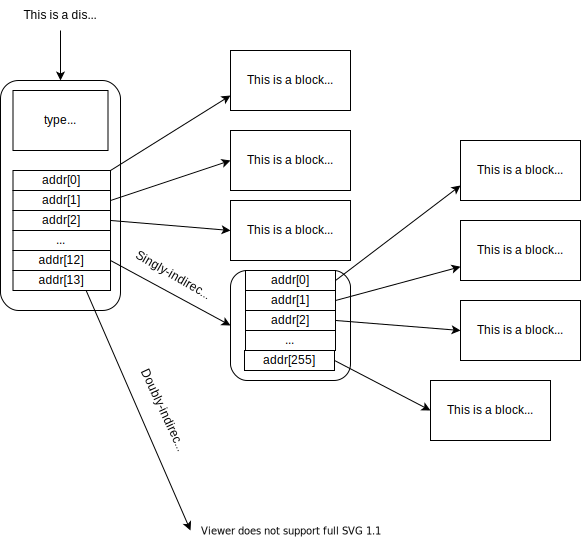

# Soft Link VS. Hard Link

**Hard link** is directly associated with inode.

**Soft link** itself is an inode, which contains a path to a **hard link** and has **ONLY ONE** referrence(in `xv6`).

# Lab 9 - File System

Here is [the original requirement](https://pdos.csail.mit.edu/6.S081/2021/labs/fs.html).

## Task 1 - Big File

### Specification

Increase the maximum size of an xv6 file. Currently xv6 files are limited to 268 blocks, or 268\*BSIZE bytes (BSIZE is 1024 in xv6). This limit comes from the fact that an xv6 inode contains 12 "direct" block numbers and one "singly-indirect" block number, which refers to a block that holds up to 256 more block numbers, for a total of 12+256=268 blocks.

Modify `bmap()` so that it implements a doubly-indirect block, in addition to direct blocks and a singly-indirect block. You'll have to have only 11 direct blocks, rather than 12, to make room for your new doubly-indirect block; you're not allowed to change the size of an on-disk `inode`. The first 11 elements of `ip->addrs[]` should be direct blocks; the 12th should be a singly-indirect block (just like the current one); the 13th should be your new doubly-indirect block. You are done with this exercise when `bigfile` writes 65803 blocks and `usertests` runs successfully.

#### Hints:

Hints:

- Make sure you understand `bmap()`. Write out a diagram of the relationships between `ip->addrs[]`, the indirect block, the doubly-indirect block and the singly-indirect blocks it points to, and data blocks. Make sure you understand why adding a doubly-indirect block increases the maximum file size by 256\*256 blocks (really -1, since you have to decrease the number of direct blocks by one).
- Think about how you'll index the doubly-indirect block, and the indirect blocks it points to, with the logical block number.
- If you change the definition of `NDIRECT`, you'll probably have to change the declaration of `addrs[]` in `struct inode` in `file.h`. Make sure that `struct inode` and `struct dinode` have the same number of elements in their `addrs[]` arrays.
- If you change the definition of `NDIRECT`, make sure to create a new `fs.img`, since `mkfs` uses `NDIRECT` to build the file system.
- If your file system gets into a bad state, perhaps by crashing, delete `fs.img` (do this from Unix, not xv6). `make` will build a new clean file system image for you.
- Don't forget to `brelse()` each block that you `bread()`.
- You should allocate indirect blocks and doubly-indirect blocks only as needed, like the original `bmap()`.
- Make sure `itrunc` frees all blocks of a file, including double-indirect blocks.

### Solution

The structure of inode and disk block.

1. In [`kernel/fs.h`](kernel/fs.h), decrease `NDIRECT` from 12 to 11, change `uint addrs[NDIRECT+1]` to `uint addrs[NDIRECT+2]`(**REMEMBER TO APPLY THE SAME CHANGE IN [`kernel/file.h::struct inode`](kernel/file.h)**). The `addr[NDIRECT+1]` is a doubly-indirect block. Besides, modify `MAXFILE` because we have increased the max file size.
2. In [`kernel/fs.c::bmap()`](kernel/fs.c), add code to support doubly-indirect block. **REMEMBER TO `brelse()` THE FIRST BLOCK BEFORE READING THE SECOND BLOCK.**
3. Add code in `kernel/fs.c::itrunc()` to free the doubly-indirect block.

## Task 2 - Symbolic Links

### Specification

Implement the `symlink(char *target, char *path)` system call, which creates a new symbolic link at path that refers to file named by `target`.

1. We can specify either to open the symbolic file itself or to open the non-symbolic file which the symbolic file linked to.
2. `link()` and `unlink()` a symbolic file is operated on the symbolic file itself, not the non-symbolic file it linked to.
3. It is OK to symbolically link a file to an non-exist file.
4. Symbolic link must link to a non-symbolic file(if it exists).
5. It is not allowed to form a cycle in symbolic link(i.e. b->a->b).

### Solution

1. In [`kernel/sysfile.c::sys_symlink()`](kernel/sysfile.c):
   1. Find the target file by the `target` path, may use recursive search if `target` itself is a symbolic link;
   2. If the target file does not exist, create a symbolic file by calling `create(path, T_SYMLINK, 0, 0)`. Write `target` to the symbolic file and return 0.
   3. Else, update the target file's `nlink`. Create a symbolic file by calling `create(path, T_SYMLINK, 0, 0)`. Find the `target` file according to its path.
   4. **Before each call to `create()`, examine if `path` already exists. It is not allowed to have duplicated `path`.**
2. In `sys_open()`, insert a piece of code to handle the case if we want to open the non-symbolic file which the symbolic path linked to. The steps are the same as above.

