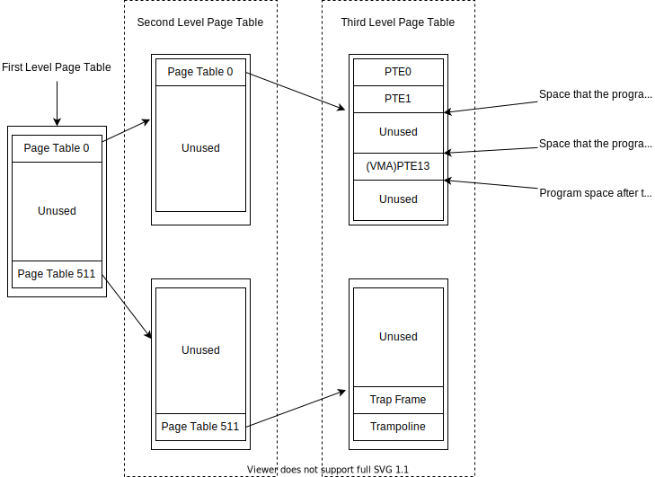

**Update on Jan 08, 2022:** I added an enhanced test in `mmaptest()` to ensure the correctness of random access to a VMA range. Besides, the test also probe the abnormal case in which the user program may try accessing an address out of its VMA. In this case, the user program should be killed.

If you are interested, please refer to [`user/mmaptest.c`](user/mmaptest.c).

# Lab 10 - mmap

[Here](https://pdos.csail.mit.edu/6.S081/2021/labs/mmap.html) is the original lab specifics.

## Lab Specification

- Implement `void *mmap(void *addr, size_t length, int prot, int flags, int fd, off_t offset);` to memory-mapping a file. You can assume that `addr` will always be zero, meaning that the kernel should decide the virtual address at which to map the file. `mmap` returns that address, or `0xffffffffffffffff` if it fails. `length` is the number of bytes to map; it might not be the same as the file's length. `prot` indicates whether the memory should be mapped readable, writeable, and/or executable; you can assume that `prot` is `PROT_READ` or `PROT_WRITE` or both. `flags` will be either `MAP_SHARED`, meaning that modifications to the mapped memory should be written back to the file, or `MAP_PRIVATE`, meaning that they should not. You don't have to implement any other bits in `flags`. `fd` is the open file descriptor of the file to map. You can assume `offset` is zero (it's the starting point in the file at which to map).

- `munmap(addr, length)` should remove `mmap` mappings in the indicated address range. If the process has modified the memory and has it mapped `MAP_SHARED`, the modifications should first be written to the file. An `munmap` call might cover only a portion of an mmap-ed region, but you can assume that it will either unmap at the start, or at the end, or the whole region (but not punch a hole in the middle of a region).

## How Does `mmap` Work?

In my implementation, when `mmap` is called:

1. The kernel will allocate a range of page-aligned address in the user space as Virtual Memory Area by increasing `myproc()->sz`, and mark their PTEs with ONLY `PTE_W`, which means they are VMA pages. 

2. I do not give them any other permissions because they are currently not associated with a physical page, so any read/write operation on them should raise a page fault to `usertrap`.

3. When the user program want to access these VMA pages, `usertrap` will handle the page fault and read in corresponding pages from the file mapped to, then set the PTEs with `PROT | PTE_U`. **Here `PTE_U` not only means that the user program can access the VMA page, but also means that the VMA page is associated with a physical page. It is important because the `uvmfree(), uvmcopy(), etc` functions can distinguish VMA pages with no physical page and VMA pages associated with physical pages.**

4. User programs usually claims more space than they needed when they are executed. Usually it's not a problem, but `mmap` will cause a gap between the VMA and the program space. For example: 

   

   In this case, `uvmcopy()` should skip the unused PTEs between the user program and the VMA. 

## Solution

1. In [`kernel/proc.h`](kernel/proc.h), define a `VMA` structure recording the starting address, length, `PROT`, file and flags. Add an array of `struct Vma` to `struct proc`.
2. In [`kernel/riscv.h`](kernel/riscv.h), define some bits in PTE: use a reserved bit (RSW) to distinguish a VMA PTE. Those PTEs are not necessarily mapped to a physical memory, so the RSW bit is crucial to stop `uvm*` functions from checking the validity of those PTEs and operating on those PTEs.
3. In [`kernel/sysproc.c`](kernel/sysproc.c), implement `mmap()` and `munmap()`
4. In [`kernel/proc.c`](kernel/proc.c), slightly modify the `fork()` to copy the VMA structure from the parent to the child
5. In [`kernel/vm.c`](kernel/vm.c), modify `mappages(), uvmunmap(), uvmcopy()` to support the operations on a VMA mapping
6. In [`kernel/trap.c`](kernel/trap.c), modify the `usertrap()` to allocate physical pages when access to VMA is detected. **Remember to solve other situations to pass the `usertests`**
